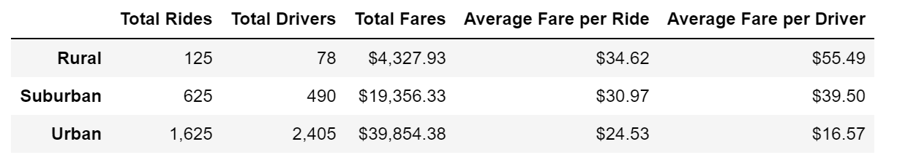

# PyBer_Analysis 
## Overview of the analysis  
PyBer is a ride-sharing company who's looking for the impact of city type to weekly total ride fares. With the data sets provided by PyBer, we were able to put out a summary to show the total weekly fare, city type, number of drivers and rides. A multiple-line chart was also created to show the total weekly fare of each city type from January to April. At the end, we aim to provide some business recommendation to the CEO with the findings.  
## Results

Above is the summary dataframe. It indicates that:  
* Urban cities have the highest total weekly fares, highest amount of rides and drivers.
* Rural cities have the highest average fares per ride and per driver.

  
From the line chart above, we can summarize that:
* Towards the end of Feburary, total fares were at a peak for all three city types
* In both urban and rural cities, total fares were slghtly decreasing during the mddle of April.
